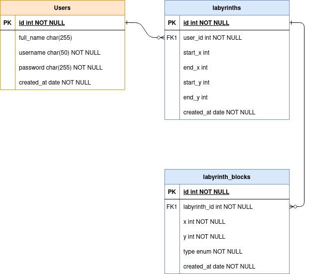
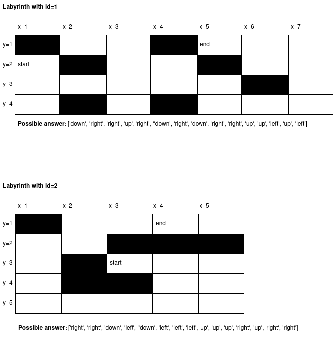

## Installation
<p>Please be careful to follow these steps for installing:</p>

```bash
$ npm install
```
Install the MySQL|MariaDB on your machine and set its configuration in the `.env` file.\
Make sure of your DB configuration before starting the app, so the Migration is performed automatically.

### Running the app

```bash
# development
$ npm run start

# watch mode
$ npm run start:dev

# production mode
$ npm run start:prod
```

and now, serve the site via `localhost:3000`.

For testing the APIs, it is a <a href='./labyrinth-postman.json'>labyrinth-postman.json</a> file which is exported from postman.\
At first you can import it in your postman application then use it.

### Test

```bash
# unit tests
$ npm run test
```

## Description

### Framework
1. I used the Nest framework to do this task for two reasons:\
1.1. It's based on Typescript\
1.2. My previous experience in it

2. Nest makes use Express (the default) and Fastify, and didn't change the Express.
3. Nest provides the ability of OOP and functional programming easily.
4. It solves the main problem of JavaScript -> Architecture. So it's easier for me to understand as a Laravel/PHP developer, because its architecture is based on MVC.
5. It provides an out-of-the-box application architecture which allows developers and teams to create highly testable, scalable, loosely coupled, and easily maintainable application.
6. It has its own CLI, it causes to install it easily and make `resources`, `controllers`, etc with it.

### Database
1. Actually I'm familiar with MySQL and before starting the task, according to an ERD I already drew, I drew it as a relational database, so I used MySQL.
   


## How to use

First of all, you have to create a user, then it's cardinal to create an empty labyrinth, after that you have to create all the labyrinth's blocks, after that, define the start and end block.

Also you can import this <a href='./public/labyrinth_db.sql'>file</a> on your database to have below examples with a test user.
## Example

